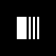

<h1 align="center">
   <h1>D3</h1>
</h1>

<p align="center">
  

  
</p>


## 💻 Project

Application developed to have a basis to predict a possible contagion of covid during the next few days.

## :hammer_and_wrench: Features

- [ x ] OurWolrdInData API's Covid19.
- [ x ] Connection to OurWolrdInData Covid19 Database;
- [ x ] Node.js application console input;
- [ x ] Node.js application result on console;
- [ x ] Covid 19 contagion forecast in the world.

## ✨ Technologies

- [ x ] Javascript
- [ x ] Node.js
- [ x ] Yarn
- [ x ] Jest
- [ x ] Axios
- [ x ] Dayjs
- [ x ] Readline Sync

## 🔨 Project Architecture Proposal

...

## 🔖 Layout

You can view the project layout through this [link](https://www.google.com). It is necessary to have an account [Figma](http://figma.com/) to access.

## Running the project

Use **yarn** or **npm install** to install project dependencies.
Then start the project.

After installing the dependencies, use

```cl
yarn start
```

or

```cl
npm init
```

## 📄 License

This project is under MIT license. See the file [LICENSE](./LICENSE) for more details.

<br />

---

Made with 🤍 by [João Alcântara](https://github.com/joaoalcdev) 👋🏻
